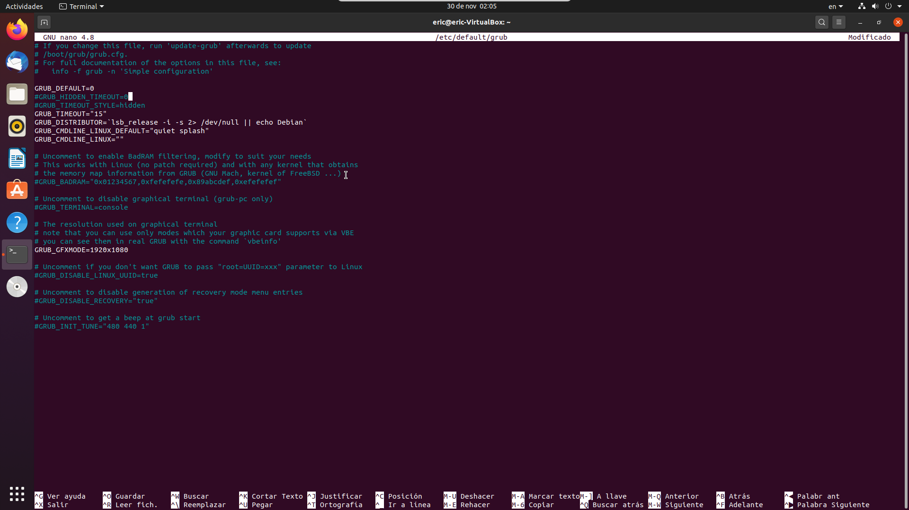
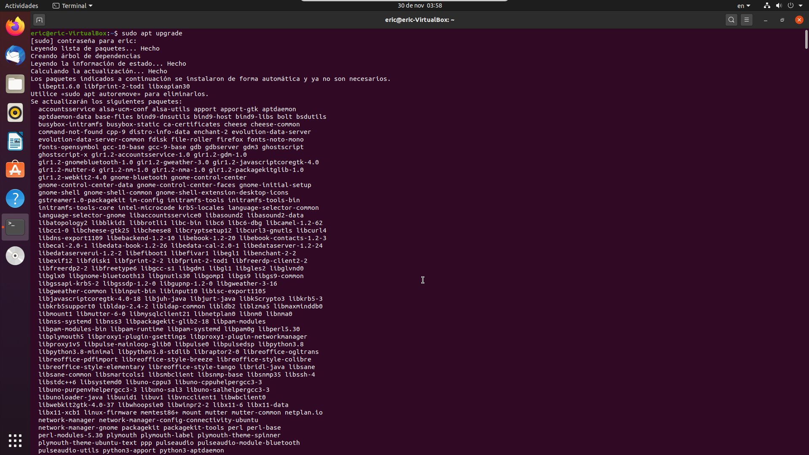

#### 1. Busca en internet ejemplos de sistemas operativos atendiendo a:

a)El número de procesos que se pueden ejecutar concurrentemente

| Monotarea | Multitarea |
| :---: | :---: |
| MS-DOS | Windows 10 |
| Windows95 | Ubuntu 20.04 |
| AmigaOS | MacOS |

b)El número de usuarios atendidos simultáneamente

| Monousuarios | Multiusuarios |
| :---: | :---: |
|  MS-DOS | Windows Server 2016 
| Windows 95 | Ubuntu Server 20.04 |
| AmigaOS | Ubuntu 20.04 |
c)El tipo de procesamiento

| Tiempo Real | Interactivos | Por lotes |
| :---: | :---: | :---: |
| QNX | DigitaliX | SCOPE |
| LynxOS | MacOS | EXEC II |
| BlackBerry 10 | Windows 10 | UNIVAC 110 |

d)El sistema de interfaz empleado

| Grafica | Textual |
| :---: | :---: |
| Windows 10 | MS-DOS |
| Ubuntu 20.04 | Windows Server 2016 |
| MacOS | Ubuntu Server 20.04 |

e)La forma de ofrecer servicios

| Sistemas Operativos Cliente | Sistemas operativos en red | Sistemas operativos distribuidos |
| :---: | :---: | :---: |
| Windows 10 | Windows Sever 2016 | Spring |
| Ubuntu 20.04 | Ubuntu Server 20.04 | Amoeba |
| MacOS | CentOS | Taos |

#### 2. Busca en internet ejemplos de sistemas operativos para cada tipo de arquitectura.

| Por capas | Monoliticos | Hibridos |
| :---: | :---: | :---: |
| MINIX | Linux | MacOS |
| THE | Syllable | Windows(FamiliaNT) |
| Multics | Windows95 | ReactOS |

#### 3. Crea una unidad flash USB arrancable Windows 10 mediante al utilidad Rufus (https://rurfus.ie/) sobre Microsoft Windows. Para ello, descarga previamente la imagen .iso desde la página oficial de Microsoft o directamente a través de la propia aplicación Rufus. Lee los tutoriales de ayuda, si fuese necesario, presentando atención al esquema de particióny al sistema destino. Comprueba en un equipo físico (o máquina virtual), que se inicia el proceso de instalación. ¿Qué ocurre si el esquema de partición no se ajusta con el sistema destino? Compruébalo modificándolo a través del BIOS Setup UtilityEnlace descarga Windows 10

#### 4. Crea una máquina virtual en Oracle VM VirtualBox para realizar una instalación de Microsoft Windows. Ten en cuenta los requisitos mínimos y recomendados. Documenta y detalla todos los pasos del proceso de instalación adjuntando también capturas de pantalla.

#### 5. Crea una máquina virtual en Oracle VM VirtualBox para realizar una instalación de la última versión LTS de Ubuntu Desktop. Ten en cuenta los requisitos mínimos y recomendados. Crea manualmente y durante el proceso de instalación las particiones que sean necesarias. Documenta y detalla todos los pasos del procesos de instalación

#### 6. A través de la aplicación NTLite, crea una instalación desatendida donde se añada la característica Internet Information Services. Comprueba la correcta generación del .iso en una máquina virtual.

#### 7. Explica el esquema de particiones predeterminado tras la instalación de Microsoft Windows del ejercicio 4. Para ello, ejecuta el 'Administrador de discos', detallando el contenido de cada partición

- La primera particion sirve para guardar el gestor de arranque, y la configuracion de inico de windows, ademas con los datos de la misma se utilizan como referencia para cuando bloqueas un disco con la tecnologia Bitlocker
- La segunda particion sirve para almacenar los datos del sistema y los programas principales
- La tercera particion sirve para poder restaurar el sistema a valores de fabrica (como si estuviera acabado de instalar el sistema operativo)

#### 8. Conociendo los archivos de configuración del gestor de arranque de GNU/Linux (GRUB 2)y a partir del ejercicio 5, modifica el gestor de arranque de manera que aparezca un menú gráfico que ofrezca entre la carga de Ubuntu Desktop y el programa de testeo de memoria memtest86+.bin con una imagen personalizada de fondo y help,ubuntu.com/community/Grub2 como apoyo.

#### 9. En Microsoft Windows:
a)Descarga un navegador web (que no tengas instalado) desde su página oficial e instálalo

b)Localiza el nuevo navegador web en 'Aplicaciones y características' de Windows. Ahora desinstálalo.

c)Desactiva Internet explorer (características de Windows) y vuelve a activarlo.

d)Lista las actualizaciones de Microsoft Windows. ¿Existe alguna pendiente?

#### 10. A través de un terminal de texto en Ubuntu Desktop:
a)Actualiza los paquetes disponibles

b)Instala el programa Synaptic

c)A través de Synaptic, instala un navegador web que no tengas instalado en Ubuntu Desktop.

d)Desinstala el programa Synaptic

e)Actualiza el sistema

