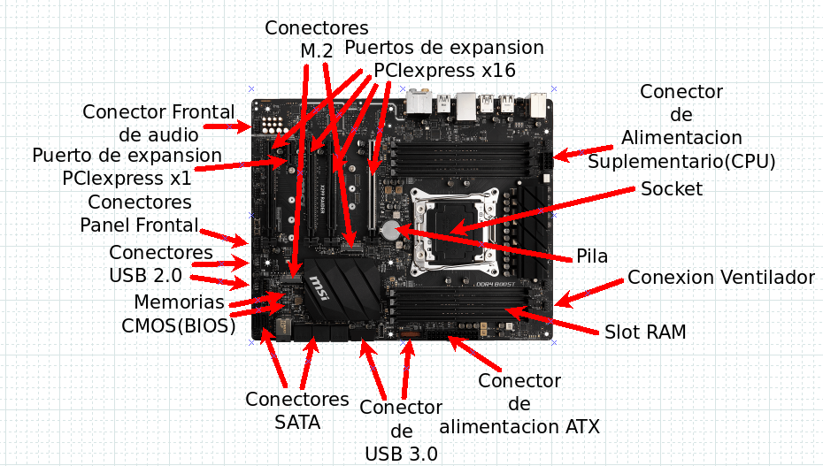
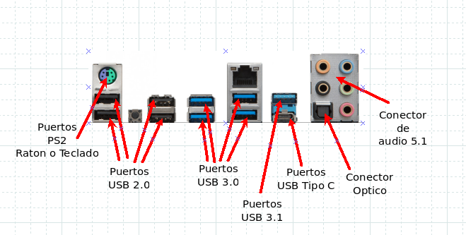

# Sistemas informáticosUnidad 1
### 1.Accede a la página web del fabricante MSI y localiza la placa base MSI X220 RAIDER (https://es.msi.com/Motherboard/X299-RAIDER/Specification).
### Realiza los siguientes ejercicios:
- Descarga una imagen de la placa base y otra de los conectores externos del panel trasero.Señala aquellos elementos estudiados, indicando su nombre técnico.

- ¿Qué factor de forma tiene la placa base?
- Procesador. ¿Qué tipo de socket de procesador tiene? ¿Con qué procesadores es compatible la placa base?
- Memoria RAM. ¿Qué módulos de memoria soporta? ¿Qué cantidad máxima de memoriaRAM se puede instalar? ¿Dispone de tecnología multicanal?
- Qué chipset monta la placa base? Indica las características del mismo mediante un diagrama o describiéndolo•Capacidad de expansión. ¿De cuántas ranuras de expansión dispone y de qué tipo?
- Conectores internos. ¿De qué conectores internos dispone y cuál es su número?
- ¿La placa base permite resetear la memoria BIOS RAM-CMOS? ¿Si lo permite, puedes explicar cómo?
- ¿Cuántos conectores de alimentación posee? ¿De qué tipo?•Indica el procedimiento para descargar los drivers de la placa base
